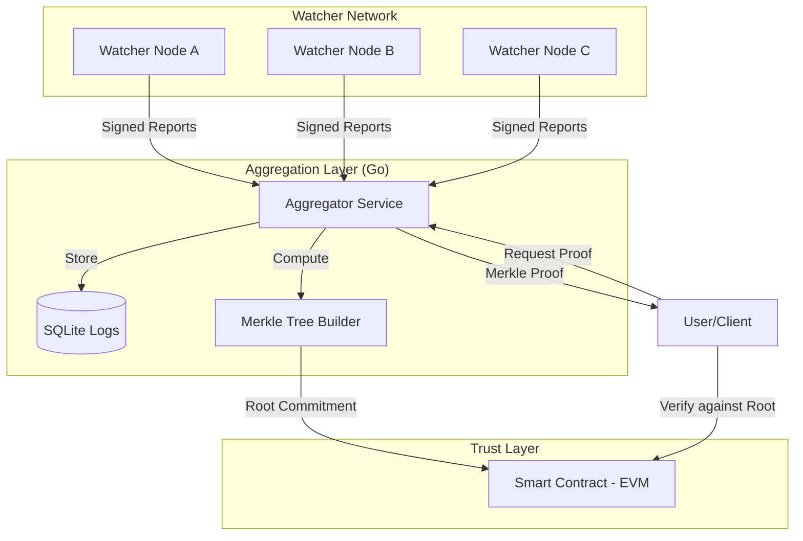

# 🛡️ Decentralized SLA Monitoring (Proof of Uptime)

> **Status: 🚧 Work in Progress**  
> This project is currently under active development. Some features may be experimental or in the design phase.

## 🎯 Project Overview
Decentralized SLA Monitoring is a protocol designed to replace trust-based uptime claims with cryptographically verifiable proofs. Instead of relying on a single central authority to report a service's uptime, this project leverages a distributed network of nodes to provide evidence that a service was active and responsive at any given point in time.

## 🧠 The Problem
Traditional Service Level Agreement (SLA) monitoring is fundamentally broken:
- **Centralized Trust:** Users must trust the provider's own monitoring logs.
- **Opacity:** There is no way for a third party to independently verify if a service was down without having their own dedicated monitoring stack.
- **Manipulation:** Logs can be edited or deleted after an incident to avoid penalties.

## 💡 The Solution: Proof of Uptime
Our protocol ensures transparency and immutability through:
1.  **Distributed Watchers:** Multiple nodes monitor the same endpoints from different locations.
2.  **Cryptographic Signing:** Each monitoring result is signed by the watcher node.
3.  **Merkle Tree Aggregation:** Thousands of reports are aggregated into a single Merkle Tree, allowing for efficient inclusion proofs.
4.  **Blockchain Anchoring:** The Merkle Root is committed to a smart contract, providing an immutable timestamped record.

## 🏗️ Architecture



## 🛠️ Tech Stack
- **Backend:** [Go](https://go.dev/) (Watcher & Aggregator)
- **Smart Contracts:** [Solidity](https://soliditylang.org/) (EVM Anchoring)
- **Cryptography:** Merkle Trees, Ed25519 Signatures
- **Database:** SQLite (Local log storage)
- **API:** RESTful API for proof retrieval

## 🗺️ Progress & Roadmap

- [x] **Week 1: Watcher Network** - Core monitoring logic and signing.
- [x] **Week 2: Aggregation Layer** - Merkle tree construction and Proof API.
- [/] **Week 3: Blockchain Integration** - Smart contract deployment and anchoring. (In Progress)
- [ ] **Week 4: Trust & Adversarial Layer** - Reputation system and consensus logic.
- [ ] **Week 5: Privacy Layer** - Optional Zero-Knowledge proofs for private SLA verification.

## 🚀 Getting Started

### Prerequisites
- Go 1.21+
- Rust (optional, for specific watcher builds)
- Node.js (for smart contract deployment via Hardhat/Foundry)

### Installation
1.  **Clone the repository:**
    ```bash
    git clone https://github.com/rhine-pereira/Decentralized-SLA-Monitoring.git
    cd Decentralized-SLA-Monitoring
    ```

2.  **Run the Aggregator:**
    ```bash
    cd aggregator
    go run main.go
    ```

3.  **Run Watcher Nodes:**
    Watcher nodes require a configuration file. You can run multiple nodes with different configurations:
    ```bash
    cd watcher-node
    # To run node A
    go run . -config configs/config_A.json
    # To run node B in another terminal
    go run . -config configs/config_B.json
    ```
    *Note: The node will automatically generate its Ed25519 keys in the `keys/` directory and save signed logs in `logs/`.*

### Configuration Examples
**Watcher Node (`config.json`):**
```json
{
  "node_id": "Node_01",
  "urls": ["https://api.yourservice.com/health"],
  "interval_seconds": 10,
  "log_dir": "logs",
  "key_dir": "keys"
}
```

**Aggregator (`config.yaml`):**
```yaml
watcher_logs_dir: "../watcher-node/logs"
database_path: "./db/sla_data.db"
output_dir: "./output"
poll_interval_seconds: 60
api:
  port: 8080
blockchain:
  enabled: false
```

### Verification API
The Aggregator provides a REST API to retrieve proofs and verify them against the blockchain state.

| Endpoint | Description |
|----------|-------------|
| `GET /root?bucket_id={id}` | Get Merkle root and metadata for a specific time bucket. |
| `GET /proof?url={url}&timestamp={ts}` | Get full inclusion proof, signature status, and on-chain verification for a monitoring event. |
| `GET /chain/root?bucket_id={id}` | Directly fetch the root stored in the smart contract. |

**Example Proof Request:**
```bash
curl "http://localhost:8080/proof?url=https://google.com&timestamp=1713102300"
```

## 📄 License
This project is licensed under the MIT License - see the [LICENSE](LICENSE) file for details.

---
*Built with ❤️ for a more transparent web.*
